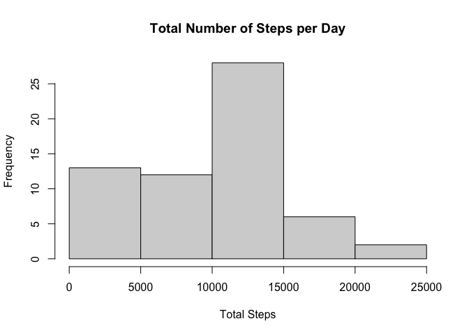
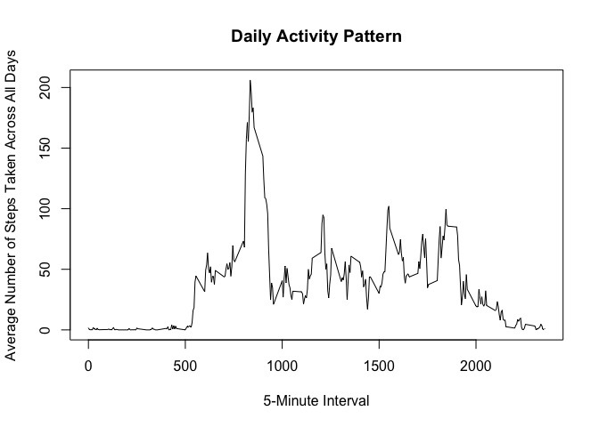
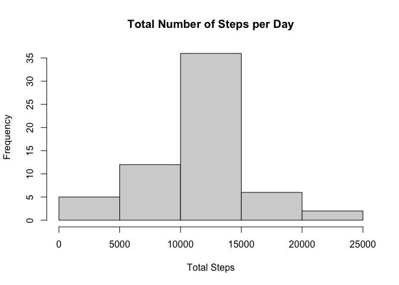
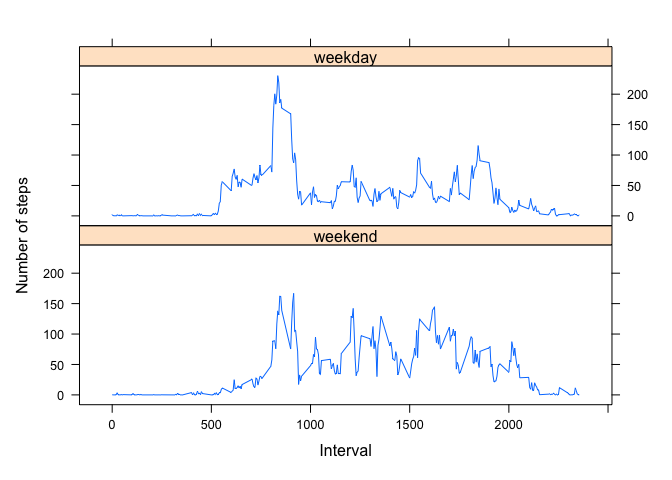

## Loading and preprocessing the data

1. I created a data directory and unzipped and read the csv.

```r
if (!file.exists("data")) {
  dir.create("data")
}
unzip(zipfile = "./activity.zip", exdir = "./data")
activityData <- read.csv("./data/activity.csv")
```

2. After reading the data, I processed it by transforming the date variable to a Date in R.

```r
activityData$date <- as.Date(activityData$date, "%Y-%m-%d")
```

## What is mean total number of steps taken per day?

1. To find the mean total number of steps per day, first I calculated the total number of steps taken per day (ignoring missing values).

```r
totalSteps <- with(activityData, tapply(steps, date, sum, na.rm = TRUE))
```

2. Next, I made a histogram of the total number of steps taken each day:

```r
hist(totalSteps, main = "Total Number of Steps per Day", xlab = "Total Steps")
```

<!-- -->

3. I calculated the mean and median of the total number of steps taken per day as shown below.

```r
mean(totalSteps, na.rm = TRUE)
```

```
## [1] 9354.23
```

```r
median(totalSteps, na.rm = TRUE)
```

```
## [1] 10395
```
The mean is 9354.23 and the median is 10395.

## What is the average daily activity pattern?

1. I made a time series plot of the 5-minute interval and the average number of steps taken, averaged across all days:

```r
meanStepsPerInterval <- with(activityData, tapply(steps, interval, mean, na.rm = "TRUE"))
plot(rownames(meanStepsPerInterval), meanStepsPerInterval, type="l", main = "Daily Activity Pattern", xlab = "5-Minute Interval", ylab = "Average Number of Steps Taken Across All Days")
```

<!-- -->

2. The 5-minute interval that on average across all the days in the dataset contains the maximum number of steps is 835. The average steps for that interval is 206.1698 (see below).

```r
meanStepsPerInterval[meanStepsPerInterval==max(meanStepsPerInterval)] # gets the row where the mean steps is equal to the maximum
```

```
##      835 
## 206.1698
```

## Imputing missing values

1. The total number of missing values (rows with NA) in the dataset is 2304. The steps variable is the only variable with NA values.

```r
sapply(activityData, function(x) sum(is.na(x)))
```

```
##    steps     date interval 
##     2304        0        0
```

2. I decided my strategy to replace the missing values would be to fill them in with the mean for that 5-minute interval.

3. Below I show how I created a new dataset, called activityDataFilled, that is equal to the original dataset but with the missing data filled in with the mean for that 5-minute interval.

```r
meanStepsDf <- data.frame(meanStepsPerInterval) # make mean steps a data frame
meanStepsDf$interval <- as.numeric(rownames(meanStepsPerInterval)) # add interval as a variable
activityDataReplaceNAs <- merge(activityData, meanStepsDf, all.x = TRUE, by = "interval") # merge by interval
stepsNA <- is.na(activityDataReplaceNAs$steps) # credit to the answers at https://stackoverflow.com/questions/51777999/replace-missing-values-with-calculated-values for examples of how to replace NAs
activityDataReplaceNAs$steps[stepsNA] <- with(activityDataReplaceNAs, meanStepsPerInterval[stepsNA])
activityDataFilled <- subset(activityDataReplaceNAs, select = c(steps, interval, date)) # create a subset containing only the variables of the original dataset
```

4. I created a histogram of the total number of steps taken each day with the filled in dataset and the mean and median total number of steps taken per day:

```r
totalStepsFilled <- with(activityDataFilled, tapply(steps, date, sum))

hist(totalStepsFilled, main = "Total Number of Steps per Day", xlab = "Total Steps")
```

<!-- -->

```r
mean(totalStepsFilled)
```

```
## [1] 10766.19
```

```r
median(totalStepsFilled)
```

```
## [1] 10766.19
```
The mean is now 10766.19. The median is also 10766.19, most likely because the days that had no values and previously had an estimated total of zero now have the sum of the means of each 5-minute interval. Imputing the missing data increased the estimates of the total daily number of steps.

## Are there differences in activity patterns between weekdays and weekends?

1. I created a new factor variable in the dataset with two levels: "weekday" and "weekend".  

```r
activityDataFilled$weekend <- weekdays(activityDataFilled$date)==("Saturday")|weekdays(activityDataFilled$date)==("Sunday") # create the variable
activityDataFilled$weekend <- factor(activityDataFilled$weekend, levels = c("TRUE", "FALSE"), labels = c("weekend", "weekday")) # make it a factor
```

2. I made a panel plot containing a time series plot of the 5-minute interval and the average number of steps taken, averaged across all weekday days or weekend days. It seems that, on average, the activity starts earlier on weekdays and the activity is more evenly spread out on weekends.

```r
meanStepsByIntervalAndWeekend <- aggregate(activityDataFilled$steps, by=list(interval=activityDataFilled$interval, weekend=activityDataFilled$weekend), FUN=mean)

library(lattice)
xyplot(x ~ interval | weekend, type = "l", data = meanStepsByIntervalAndWeekend, layout = c(1,2), xlab = "Interval", ylab = "Number of steps")
```

<!-- -->
